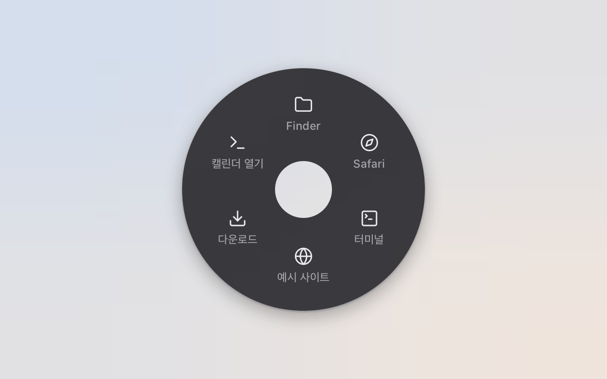
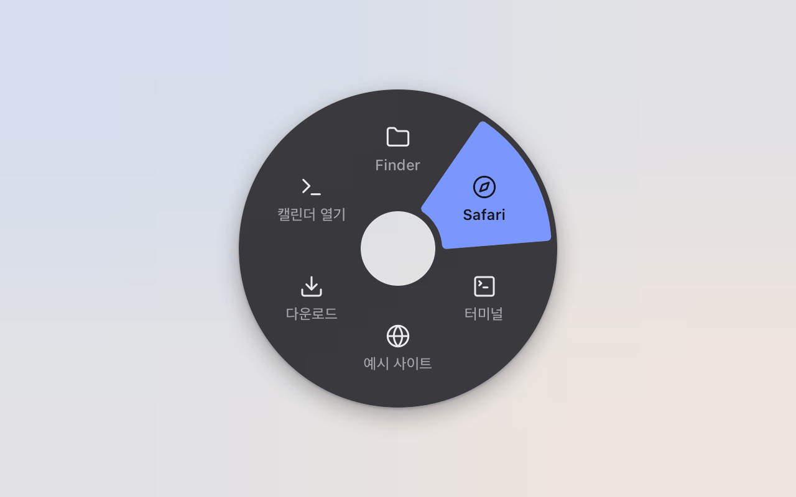
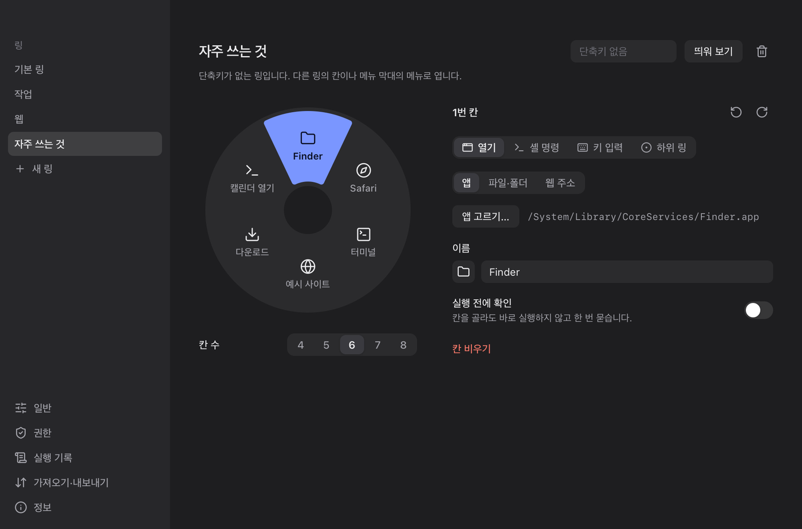
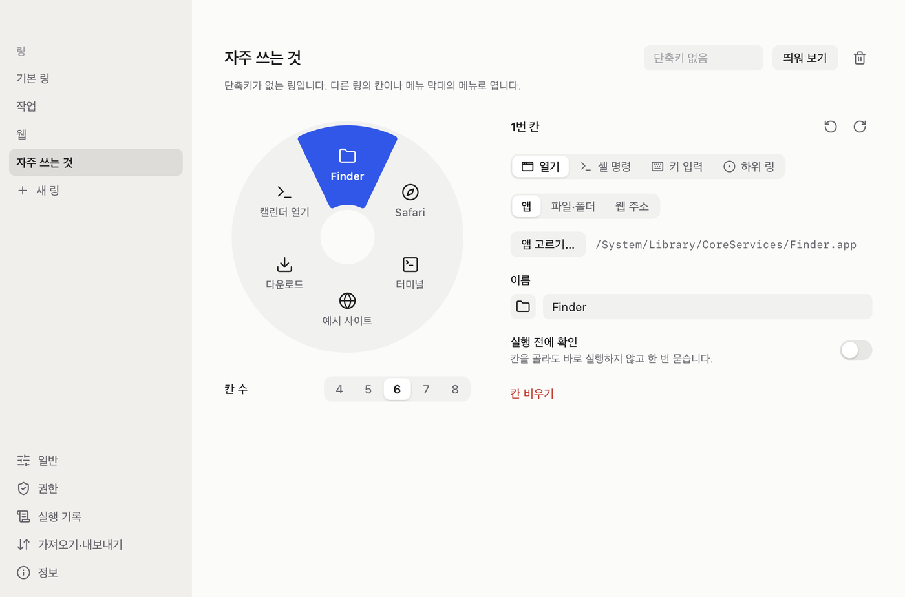

# 링링이 (RingRing)

커서 주위에 뜨는 링 메뉴입니다. macOS 의 메뉴 막대와 Windows 의 트레이에 사는 작은 앱입니다.

어느 앱 위에서든 단축키를 누르면 커서 자리에 둥근 메뉴가 뜹니다. 칸 쪽으로 움직이고 키를 놓으면 그 칸이 실행됩니다.

## 화면



단축키를 누르면 커서 자리에 링이 뜹니다.



커서를 옮기면 그쪽 칸이 골라집니다. 키를 놓으면 그 칸이 실행됩니다.



설정 창의 링 편집 화면입니다. 링 그림에서 칸을 고르고 오른쪽에서 할 일을 정합니다.



밝은 테마의 같은 화면입니다.

## 설치

파일은 [릴리스](https://github.com/zacostudio/ringring/releases/latest) 에 있습니다.

### macOS

macOS 13 이상, Apple Silicon 에서 돕니다. `RingRing-<버전>-arm64.dmg` 를 열고 RingRing 을 응용 프로그램 폴더로 옮깁니다.

Apple 서명과 notarization 이 없는 앱입니다. 그래서 내려받은 사본은 처음 열 때 Gatekeeper 가 막습니다. 터미널에서 한 번 풀어 줍니다.

```
xattr -dr com.apple.quarantine /Applications/RingRing.app
```

### Windows

Windows 10·11 (x64) 에서 돕니다. `RingRing_<버전>_x64-setup.exe` 를 실행합니다. 서명하지 않은 설치 파일이라 SmartScreen 이 한 번 묻습니다 — "추가 정보" 를 누르고 "실행" 을 고릅니다.

아래 글은 두 OS 에 함께 맞습니다. OS 마다 다른 것은 그 자리에 따로 적었고, Windows 에서만 다른 점은 [Windows 에서](#windows-에서) 에 모았습니다.

## 쓰는 법

링을 여는 방법은 두 가지입니다.

| 방법 | 어떻게 | 고르기 |
| --- | --- | --- |
| 누른 채로 (hold) | 단축키를 누르고 있습니다 | 커서를 칸 쪽으로 옮기고 키를 놓습니다 |
| 짧게 (tap) | 단축키를 짧게 눌렀다 놓습니다 | 칸을 클릭하거나 숫자 키 1~8, 또는 화살표와 Enter 를 누릅니다 |

취소하려면 커서를 가운데에 두고 키를 놓거나, Esc 를 누르거나, 링 밖을 클릭합니다.

칸 하나는 다음 가운데 하나를 합니다.

- 앱·파일·폴더·웹 주소 열기
- 셸 명령 실행
- 맨 앞 앱에 키 입력 보내기
- 하위 링 열기 (3단계까지)

## 아이콘의 메뉴

아이콘은 macOS 에서는 메뉴 막대에, Windows 에서는 작업 표시줄의 알림 영역(트레이)에 있습니다. 누르면 메뉴가 나옵니다.

- 링 이름을 고르면 그 링이 커서 자리에 뜹니다.
- 설정을 엽니다.
- 단축키를 잠시 끄거나 다시 켭니다.
- 로그인할 때 실행되게 합니다.
- 앱을 종료합니다.

칸의 실행이 실패하면 아이콘 옆에 `!` 가 붙고, 메뉴 맨 위에 "실패한 실행 보기" 가 생깁니다. 누르면 설정의 실행 기록이 열립니다. OS 의 알림도 한 줄 뜨지만, 알림을 꺼 두어도 실패는 여기서 찾을 수 있습니다.

macOS 의 Dock 에는 아이콘이 없습니다. 설정 창을 닫아도 앱은 메뉴 막대나 트레이에 남습니다.

## 설정

- **링 편집.** 링 그림에서 칸을 고르고 오른쪽에서 그 칸이 할 일을 정합니다. 칸은 4개에서 8개까지입니다. 적은 글은 다른 곳으로 가거나 창을 닫을 때 저장됩니다. 저장할 수 없는 글이 남아 있으면 창이 닫히지 않고 그 까닭을 보여 줍니다.
- **단축키.** 링마다 하나씩 정합니다. 다른 링이 쓰는 조합이나 OS 가 받지 않는 조합은 저장되지 않습니다.
- **일반.** 언어(한국어·영어·일본어), 테마, 단축키 일시 정지, 로그인할 때 실행.
- **권한.** macOS 에서는 "키 입력" 칸이 손쉬운 사용 권한을 씁니다. 나머지는 권한 없이 됩니다. Windows 에서는 받을 권한이 없습니다.
- **실행 기록.** 셸 명령의 결과와 실패한 실행을 최근 20개까지 보여 줍니다. 앱을 끄면 사라집니다. 셸 명령의 출력은 여기에만 남고, 파일·로그·알림에는 남지 않습니다.
- **가져오기·내보내기.** 링을 JSON 파일 하나로 옮깁니다. 가져온 셸 명령, 키 입력, 파일·앱 열기 칸은 "실행 전에 확인" 이 켜진 채로 들어옵니다.

macOS 에서 셸 명령이 백그라운드 작업(`… &`)을 남기고 그 작업이 출력을 쥐고 있으면, 제한 시간까지 끝나지 않은 것으로 봅니다. 제한 시간이 되면 그 작업도 같이 끝납니다. 계속 돌게 하려면 출력을 돌려 두세요 (`> /dev/null 2>&1 &`).

## Windows 에서

Windows 10·11 (x64) 에서 macOS 와 다른 점은 다음과 같습니다.

- **아이콘.** 작업 표시줄의 알림 영역(트레이)에 생깁니다. 안 보이면 `^` 를 눌러 숨은 아이콘을 봅니다. 메뉴는 macOS 와 같습니다.
- **단축키.** `Ctrl+Alt+G` 처럼 이름으로 보입니다. Windows 키가 든 조합은 Windows 가 먼저 가져가는 것이 많습니다. `Alt+Space` 는 창 메뉴를 여는 키라 피하는 것이 좋습니다.
- **셸 명령.** `cmd` 로 돕니다 (`%ComSpec% /C`). 여러 줄로 적으면 줄을 `&` 로 이어 차례로 돌립니다. 출력은 UTF-8 로 읽습니다. PowerShell 을 쓰려면 `powershell -NoProfile -Command "…"` 로 적습니다.
- **백그라운드 작업.** 실행은 `cmd` 가 끝날 때 끝납니다. `start notepad` 처럼 띄워 둔 프로그램은 그대로 남습니다. 제한 시간을 넘기면 그 명령이 띄운 프로세스를 모두 끝냅니다.
- **키 입력.** 권한 없이 됩니다. "권한" 페이지에 할 일이 없습니다. 관리자 권한으로 도는 앱은 그 입력을 받지 않습니다.
- **앱 고르기.** `.exe` 나 시작 메뉴의 바로 가기를 고릅니다.
- **파일·폴더 고르기.** 고르는 창은 파일만 고릅니다. 폴더는 경로를 적습니다 (`~\Downloads` 도 됩니다).
- **로그인할 때 실행.** 레지스트리의 `HKCU\Software\Microsoft\Windows\CurrentVersion\Run` 에 적습니다. 관리자 권한이 필요 없습니다.
- **기본 링.** 파일 탐색기, Edge, 터미널, 메모장, 다운로드 폴더가 들어갑니다.
- **데이터와 로그.** 링은 `%APPDATA%\com.zacostudio.ringring\ringring.db` 에, 로그는 `%LOCALAPPDATA%\com.zacostudio.ringring\logs\RingRing.log` 에 있습니다.

## 소스에서 빌드하고 실행하기

두 OS 모두 [Bun](https://bun.sh) 과 Rust 1.98.1 이 필요합니다. Rust 버전은 `rust-toolchain.toml` 이 맞춰 줍니다.

### macOS

macOS 13 이상, Apple Silicon 에서 돕니다. 더 필요한 것은 다음과 같습니다.

- Tauri CLI (`cargo install tauri-cli`)
- Xcode Command Line Tools

```
bun install
bun tauri:dev
```

메뉴 막대에 아이콘이 생깁니다. 처음 켜면 설정 창이 한 번 열립니다.

```
bun run typecheck      # TypeScript
bun run lint           # Biome
bun test src/          # 프런트 테스트
cd src-tauri && cargo test --features dev-agent
```

OS 입력 없이 화면을 확인할 때는 개발용 HTTP 제어 서버(dev-agent)를 켭니다. `127.0.0.1:9797` 에서만 듣고, 릴리스 빌드에는 들어가지 않습니다.

```
RINGRING_DEV_AGENT=1 RINGRING_DEV_QUIET=1 bun run tauri:dev -- --features dev-agent
```

### Windows

더 필요한 것은 다음과 같습니다.

- Visual Studio 의 "C++ 를 사용한 데스크톱 개발" 빌드 도구
- Tauri CLI 2.12 이상 (`cargo install tauri-cli --locked`). 낡은 CLI 는 설정 파일을 읽지 못합니다. 깔지 않고 `bunx @tauri-apps/cli@2` 로 돌려도 됩니다
- WebView2 런타임 (Windows 11 에는 들어 있습니다)

```
bun install
bun tauri:dev
```

`cargo tauri` 가 낡았으면 `bunx @tauri-apps/cli@2 dev --config src-tauri/tauri.dev.conf.json` 으로 돌립니다.

```
bun run typecheck
bun test src/
cd src-tauri && cargo test
```

dev-agent 는 macOS 에서만 됩니다. `bun run lint` 는 줄 끝이 LF 일 때 통과합니다 — git 이 CRLF 로 꺼냈으면 `bunx biome lint src` 로 규칙만 봅니다.

### 개발 빌드가 다른 점

개발 빌드는 identifier 가 `com.zacostudio.ringring.dev` 입니다. 설치된 앱과 데이터·로그가 섞이지 않습니다. 개발 빌드는 전역 단축키와 로그인 항목을 등록하지 않습니다. 다른 앱이 쓰는 조합을 가져가지 않게 하려는 것입니다. 단축키까지 걸어 보려면 `RINGRING_DEV_GLOBAL_SHORTCUTS=1` 을 주고 켭니다.

## 릴리스 빌드

두 OS 모두 서명하지 않습니다. Apple 계정이나 인증서는 필요 없습니다.

### macOS

```
./scripts/build.sh <버전>            # 검사, 버전 반영, .app 과 .dmg 만들기
./scripts/build.sh <버전> --dry-run  # 검사와 릴리스 컴파일만. 번들과 버전 파일은 건드리지 않습니다
./scripts/build.sh <버전> --smoke    # 개발 identifier 와 dev-agent 를 넣은 릴리스 컴파일. 릴리스 모드의 화면을 확인할 때 씁니다
```

결과물은 `release/<버전>/` 에 생깁니다. 스크립트는 커밋·태그·업로드를 하지 않습니다.

### Windows

```
.\scripts\build-windows.ps1       # 릴리스 빌드와 NSIS 설치 파일
```

배포할 파일은 `tauri build` 를 바로 부르지 말고 이 스크립트로 만듭니다. Rust 는 소스 파일의 경로를 실행 파일에 넣는데, 그대로 두면 빌드한 사람의 홈 폴더(`C:\Users\<계정>`)가 남습니다. 스크립트는 그 경로를 `~` 로 바꿔 넣고, 빌드 뒤에 실행 파일을 훑어 남은 것이 있으면 실패로 끝냅니다.

설치 파일은 `src-tauri/target/release/bundle/nsis/` 에 생깁니다. `scripts/build.sh` 는 macOS 에서만 됩니다.

## 라이선스

MIT. `LICENSE` 를 보세요.
